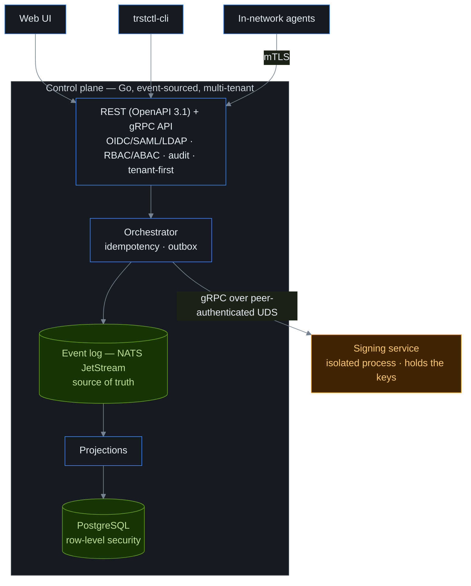

```
   __            __       __  __
  / /___________/ /______/ /_/ /
 / __/ ___/ ___/ __/ ___/ __/ /
/ /_/ /  (__  ) /_/ /__/ /_/ /
\__/_/  /____/\__/\___/\__/_/

the keys to your infrastructure,
  kept in your infrastructure
```

<p align="center"><strong>Machine Identity Security Control Plane</strong> for every credential that <em>isn't</em> a human —<br>
discover, issue, deploy, rotate, revoke, and retire X.509 certificates, SSH certs, secrets,<br>
API keys, and SPIFFE workload identities. No per-certificate or ephemeral-identity billing; you host it all.</p>

<p align="center">
<a href="https://github.com/ctlplne/trstctl/actions/workflows/ci.yml"></a>
<a href="https://github.com/ctlplne/trstctl/tags"></a>
<a href="https://goreportcard.com/report/github.com/ctlplne/trstctl"></a>


</p>

<p align="center">
<a href="#the-60-second-version">60-second version</a> ·
<a href="#why-trstctl">Why</a> ·
<a href="#what-it-answers">What it answers</a> ·
<a href="#capabilities">Capabilities</a> ·
<a href="#how-its-built">How it's built</a> ·
<a href="#try-it">Try it</a> ·
<a href="#documentation">Docs</a> ·
<a href="docs/pricing.md">Pricing</a> ·
<a href="#license">License</a>
</p>

> **New here?** Start with **[Getting started](docs/getting-started.md)** — control
> plane up and your first certificate issued, wizard or CLI. Then follow the journey
> that matches your goal: [automate TLS across your fleet](docs/journeys/automate-fleet-tls.md),
> [give Kubernetes workloads an identity](docs/journeys/kubernetes-workload-identity.md),
> [migrate from your existing CA](docs/journeys/migrate-from-existing-ca.md),
> [respond to a compromise](docs/journeys/respond-to-compromise.md), and
> [seven more](docs/index.md). Prefer the reference? The
> [feature index](docs/features.md) covers all 79 capabilities, each with a
> deep-dive page; the [glossary](docs/glossary.md) defines every term.

> **Status — active development.** A core slice is **served end to end by the running
> binary today** — certificate inventory, real X.509 issuance, the credential graph,
> risk scoring, OIDC/SAML/LDAP login, SCIM provisioning, RBAC plus ABAC,
> the hash-chained audit log, observability, resilience, backup/DR, migrations.
> Much of the broader surface is library-complete and tested but not yet wired into
> the served binary. **[Current limitations](docs/limitations.md) is the single
> authority** on which is which. trstctl is MPL-2.0 open core: the Free core is
> open-source; Enterprise and Provider/MSP capabilities live under proprietary
> `ee/`. Enterprise bills per control-plane deployment. Credentials and rotations
> are never billed ([details](#license)).

---

## The 60-second version

Imagine a large building where every person, robot, and delivery cart needs the
right key — keys that should expire, be re-cut on schedule, and be revoked the
moment one is lost — and nobody keeps a register of the locks. That's
machine-credential management at most companies today.

trstctl is the key register, the locksmith, and the courier. It finds every
lock and key (discovery), cuts new keys (issuance), delivers them to the right
doors (deployment), re-cuts them before they wear out (rotation), cancels lost
ones (revocation), and logs everything tamper-proof (audit) — where the "keys"
are [certificates](docs/glossary.md), SSH certs, [secrets](docs/glossary.md),
tokens, and workload identities.

For experts: an event-sourced, multi-tenant control plane for the full
non-human-identity (NHI) lifecycle — X.509, SSH, secrets, and
[SPIFFE](docs/glossary.md) — with private-key operations isolated in their own
process and all cryptography behind a single, swappable boundary. Skip to
[How it's built](#how-its-built).

## Why trstctl

Machine identities outnumber human ones by orders of magnitude, and most teams
manage them with a different tool per kind: one for TLS certificates, one for
secrets, one for SSH, and a closed SaaS suite for the enterprise features on
top. The result: no single inventory, no shared ownership model, no consistent
rotation, and no view of **blast radius** — what else is exposed — when a
credential leaks. You find out at 2 a.m., when a certificate nobody remembered
expires.

Three choices set trstctl apart:

- **It stays yours.** Self-hosted, data-sovereign NHI / Machine IAM on
  infrastructure you control; usage
  [telemetry](docs/telemetry.md) is opt-in, off by default, and never includes
  credential content. No credential data ships to a vendor cloud.
- **It's one model for everything.** Every non-human credential is a node in a single
  **graph** of owners, issuers, identities, and the targets they're deployed to — so
  discovery, lifecycle, policy, risk, and audit work the same way for a TLS cert, an
  SSH key, and a database password. The first proof points are served NHI posture
  routes (`GET /api/v1/nhi/posture/overprivilege`,
  `GET /api/v1/nhi/posture/stale`) and gated AI/MCP surfaces
  (`POST /api/v1/ai/rca`, `GET /api/v1/mcp/tools`) that read the same
  tenant-scoped evidence.
- **It's multi-tenant to the core.** Every row carries a tenant and is isolated by the
  database itself (not by application code), so one deployment safely serves many
  hard-isolated teams or customers. A single-org install is just the one-tenant case —
  no separate code path to drift out of sync.

## What it answers

trstctl is organized around the questions operators actually ask:

- *"What certificates, keys, and secrets do we even have — and which expire this
  week?"* → [discovery & inventory](docs/features/discovery-and-inventory.md) +
  [lifecycle](docs/features/lifecycle-and-pqc.md).
- *"If this key leaks, what else is exposed?"* → the credential graph's blast
  radius ([graph, query & AI](docs/features/graph-query-ai.md)).
- *"What should we rotate first?"* → composite risk scoring
  ([observability & risk](docs/features/observability-and-risk.md)).
- *"Who is allowed to issue — and can the requester quietly self-issue?"* →
  RBAC + ABAC + the registration-authority split
  ([policy & governance](docs/features/policy-and-governance.md)).
- *"Where are we still using weak or quantum-vulnerable crypto?"* → the CBOM
  (Cryptographic Bill of Materials) ([observability & risk](docs/features/observability-and-risk.md)).
- *"Did someone get a certificate in our name that we didn't request?"* →
  Certificate Transparency monitoring
  ([discovery & inventory](docs/features/discovery-and-inventory.md)).

Or ask the built-in assistant in plain English — it answers with cited
evidence, scoped to exactly what the caller may see.

## Who it's for

Platform and security teams who want one credential inventory they actually
own instead of a half-dozen disconnected tools; regulated and
sovereignty-conscious orgs (finance, healthcare, public sector, critical
infrastructure) that need credential automation but cannot send anything to a
third-party cloud; and MSPs or multi-team orgs that self-host once and serve
many hard-isolated tenants from one control plane.

## What it does

The same lifecycle, for every credential type:

> **discover → issue → deploy → rotate → revoke → retire**

- **Discover** what you already have — network and filesystem scans, SSH keys
  and trust, agentless cloud-certificate enumeration from AWS/Azure/GCP APIs, a
  CBOM with post-quantum posture, and Certificate Transparency monitoring.
- **Issue** automatically — a built-in ACME server (auto-renewal with no human
  in the loop), your own private CA hierarchy gated by an m-of-n key ceremony,
  and the enrollment protocols existing fleets speak (EST, SCEP, CMP).
- **Deploy** renewed credentials to where they live through capability-scoped
  connectors — web servers, load balancers, appliances, cloud cert stores. The
  shipped connectors are trusted, in-process code scoped to the capabilities
  they declare; the WASM sandbox isolates *third-party* plugins
  ([plugin trust model](docs/security/threat-model.md)).
- **Give workloads an identity** without planting secrets in them — the SPIFFE
  Workload API plus [attestation](docs/glossary.md) (cryptographic proof of
  what and where a workload is), including a broker for AI agents.
- **Manage secrets** — a versioned, envelope-encrypted store, dynamic secrets
  (created on demand, auto-revoked), encryption-as-a-service, rotation.
- **Understand & respond** — the credential graph (reachability, blast
  radius), risk scoring, drift detection, and incident workflows (compromise
  remediation, just-in-time access, break-glass).

The full catalog — all 79 capabilities, each mapped to its primary docs page —
is the [feature index](docs/features.md).

## Capabilities

"Built and tested" means real library code with unit, property, integration,
and conformance tests; [Current limitations](docs/limitations.md) is the
single authority on what is served end to end versus library-complete. The
served denominators below are checked against the repo-native
[census gate](tools/dodcensus/manifest.json) (`make dod-gate` emits the local
`wiring-census.json` receipt). Proof modes are not uniform:
**12 of 81 census rows launch the shipped binary**;
**69 of 81 are proved through the production-assembled handler** — the
production `buildRunDeps` output driving the assembled `Server.Handler`
in-process, with a hand-built `Deps` rejected. Only the process launch differs,
so each row below names the mode that proved it.

| Area | What's there |
|---|---|
| **Issuance** | ACME (+ ARI), private CA hierarchy (m-of-n ceremony, OCSP/CRL), certificate profiles + RA separation. CA integrations: **14 inventory / 14 served through the production-assembled handler**, over operator-configured, tenant-bound production assembly and provider-specific issuance. |
| **Enrollment** | EST, SCEP, CMP servers; an embedded/IoT C client; Intune/MDM challenge gating |
| **Workload identity** | SPIFFE Workload API (X.509 + JWT SVIDs), **6** cloud/hardware attesters, ephemeral issuance, an AI-agent broker |
| **SSH** | SSH certificate authority + KRL, additive trust agent (validate → reload → health-check → rollback), attestation-gated user certs |
| **Secrets** | envelope-encrypted store, transit + KMIP, PKI-as-a-secrets-engine, and rotation. Dynamic-secret backends: **8 inventory / 8 served through the production-assembled handler**. Secret-sync targets: **10 inventory / 10 served through the production-assembled handler**. Each is tenant-bound, operator-configured, and reached only through the event-projected sealed outbox. |
| **Deployment** | Deployment connectors: **24 inventory / 24 served through the production-assembled handler** (web servers, load balancers, appliances, mail proxies, databases, messaging/search targets, and cloud cert stores). Production `buildRunDeps` constructs the selected native registry; served target/identity/deploy flows perform target-specific mutation and independent readback. Also includes an example connector harness, Kubernetes agent/Operator, and cert-manager `Issuer`/`ClusterIssuer` integration. |
| **Discovery & posture** | network/filesystem, SSH, agentless cloud certs (AWS/Azure/GCP), CBOM crypto posture, Enterprise/PQC migration posture, CT monitoring, drift, risk scoring, the credential graph |
| **Key protection** | HSM/KMS backends: **6 inventory / 6 served by the launched shipped binary** through the separately shipped cgo HSM signer profile: AWS KMS, Azure Key Vault / Managed HSM, GCP Cloud KMS, PKCS#11, TPM 2.0, and YubiHSM 2. The managed-key surface remains Enterprise-license- and configuration-gated, and every provider operation stays inside the isolated signer. |
| **Crypto-agility** | classical algorithms in the MPL core; Enterprise/PQC algorithms (ML-DSA, ML-KEM, SLH-DSA, hybrid) and the PQC-migration orchestrator live behind the proprietary `ee/` boundary |
| **Platform** | REST API (OpenAPI 3.1), CLI at full parity, a unified web console — five spaces (Certificates, Secrets, Workload & SSH, Posture & response, Platform) over one shell, with a first-run wizard, journeys hub, command palette, and en/es/de localization — OIDC/SAML/LDAP sign-on, SCIM 2.0 provisioning, RBAC + ABAC, append-only audit, multi-tenancy |
| **Notifications** | Outbox-backed email, Slack, Teams, SMS, SIEM, HMAC webhook, native PagerDuty Events v2, and native OpsGenie Alert v2 delivery. The shipped binary constructs every channel family; credentials are redacted, locked where supported, and wiped on shutdown. |
| **Code signing** | Conditionally served key-backed and GitHub-OIDC keyless signing through the isolated signer. The operator pins Rekor log trust; the outbox worker publishes official HashedRekord entries and verifies their signed-entry timestamps before acknowledgement. |
| **Supply chain** | reproducible builds, cosign-signed images, and an SBOM |

## How it's built

trstctl is opinionated about architecture from the first commit, because these
properties cannot be bolted on later. Nine non-negotiables, held two different
ways. AN-1, AN-2, AN-3, AN-5, AN-8 and AN-9 are enforced by a custom
`go/analysis` linter (`trstctllint`) that fails the build on violation — one
analyzer per invariant, and for AN-9 the `licenseboundary` analyzer on top of
the `ee/` build fence. AN-4, AN-6 and AN-7 have no analyzer: "the enqueue
happened in the same transaction as the state change" is not reasonably
lintable, so those three are held by tests instead — the signer's
dependency-closure test (`cmd/trstctl-signer/core_boundary_test.go`) and the
outbox and bulkhead regression suites under `internal/orchestrator` and
`internal/bulkhead`. They aren't guidelines, they're load-bearing walls.

| | Principle (in plain terms) |
|---|---|
| **AN-1** | **Tenants can't see each other — enforced by the database.** Every row carries a tenant ID, and PostgreSQL [row-level security](docs/glossary.md) blocks cross-tenant reads even if the application code has a bug. |
| **AN-2** | **The truth is an append-only log.** State changes are events in [NATS JetStream](docs/glossary.md); the regular tables and the audit trail are *projections* rebuilt from that log — nothing is silently overwritten, and the system can be rebuilt after a disaster. |
| **AN-3** | **All cryptography lives behind one door.** A single package; nothing else may import `crypto/*`. Adding an algorithm or an HSM is a one-package change — which is how post-quantum support slots in. |
| **AN-4** | **The signing service is a separate, sacred process.** Private keys live in their own address space, reached over gRPC on a peer-authenticated Unix socket — no HTTP server, no SQL driver. If it's compromised, the company is over, so it's treated that way. |
| **AN-5** | **Idempotency on every change.** Mutating APIs require an `Idempotency-Key`, and the Compose E2E gate owns the identity-transition issuance retry proof; until CORRECT closes that served-stack receipt, this path is a known AN-5 blocker rather than a blanket "retries never mint twice" claim. |
| **AN-6** | **An outbox for every external call.** The intent to call out (a CA, a webhook) is written in the *same database transaction* as the state change, and a worker delivers it at least once — so calls are never lost on a crash. |
| **AN-7** | **Bulkheads and backpressure.** Each subsystem has its own bounded worker pool; one slow connector or a discovery storm can never starve the API. |
| **AN-8** | **Memory safety for keys.** Secret material lives in locked, zeroed `[]byte`, never a Go `string` (which the garbage collector can copy freely). A key lives in RAM for milliseconds, not indefinitely. |
| **AN-9** | **The editions boundary.** Commercial code lives only under `ee/`; core never imports it, and a core-only build links zero `ee/` packages. Multi-tenancy, the crypto boundary, audit/export rights, and the offline license verifier stay in the MPL core. |



Five binaries make this real: `trstctl` (the control plane, which supervises the
signer as a child process), `trstctl-signer` (the isolated key-holder),
`trstctl-agent` (the in-network worker), `trstctl-operator`, and `trstctl-cli`.
Under the hood: ~1810 Go files across the internal subsystem packages, with
property, differential, fuzz, and real-PostgreSQL/NATS integration tests, plus
the architecture linter in CI.

## Try it

Requires Go 1.26.5+, Node 22+ (for the web UI), and Docker (for the evaluation stack).

```bash
git clone https://github.com/ctlplne/trstctl
cd trstctl

make build    # control plane, signer, agent, operator, and CLI -> ./bin
make web      # build the React UI into the binary's embed
make test     # unit + property + embedded-PostgreSQL/NATS integration tests
make lint     # full lint: gofmt, vet, architecture, golangci-lint, actionlint
make lint-partial # explicit local subset when optional lint tools are absent
```

Two Compose stacks, side-by-side safe:

```bash
# Pre-populated click-through demo: local SSO, seeded data, UI at https://localhost:9443
# (sign in with SSO as demo-admin@trstctl.local).
docker compose -f deploy/demo/docker-compose.yml up --build

# Blank eval stack: PostgreSQL, NATS, control plane at https://localhost:8443 —
# the recommended path; same external-datastore wiring as production.
docker compose -f deploy/docker/docker-compose.yml up --build
```

The demo stack includes a LocalStack KMS configuration for exploring the
managed-key surface. That convenience stack is not LocalStack conformance
evidence; the six served census rows come from the gate's nonce-bound
vendor-emulator, SoftHSM, and swtpm lifecycle receipts against the shipped
control-plane and cgo signer artifacts.

Running the bare `trstctl` binary instead uses bundled single-node PostgreSQL
and embedded NATS: it downloads the pinned runtime once, verifies it against
`deploy/supply-chain/embedded-postgres.json` (`linux-amd64`, `linux-arm64v8`,
`darwin-arm64v8`), and fails closed on an unpinned host archive.

The control plane is serving about two minutes later; issuance itself is
sub-second — the end-to-end integration test mints a certificate into
inventory in tens of milliseconds
(`TestAssembledServerIssuesCertIntoInventory`, ~20 ms). The full walkthrough —
connect a CA, issue a cert, install an agent — is
**[Getting started](docs/getting-started.md)**. Script it through the REST
API, which publishes its OpenAPI 3.1 spec at `/api/v1/openapi.json`, or the
[CLI](docs/cli.md) at full API parity.

## What trstctl is not

trstctl is honest about its edges by design:

- **It manages machines, not people.** It is *not* a human IAM/SSO product for your
  employees' accounts — it uses OIDC, SAML, or LDAP / Active Directory to log
  *operators* in, and complements your human identity provider rather than replacing it.
- **It is self-hosted, not a SaaS.** Nothing phones home; you run it on your own
  infrastructure.
- **Its AI is grounded and read-only.** The assistant answers from cited evidence and
  never acts on its own; issuance, deployment, and remediation are gated by policy and,
  where configured, human approval.
- **It is precise about its own maturity.** A core slice is served end to end; the rest
  is library-complete and tested, with the gaps named in
  [Current limitations](docs/limitations.md) — never glossed over.

## Repository layout

```
cmd/        # binaries: trstctl (control plane), trstctl-signer (isolated key-holder),
            #           trstctl-agent (in-network worker), trstctl-operator, trstctl-cli
internal/   # subsystem packages: crypto (the one crypto boundary), signing, events,
            #   projections, store, orchestrator, api, ca, protocols/*, secrets..., graph, query, ...
plugins/    # WASM plugin category roots — ca/ and connectors/
tools/      # trstctllint — the architecture linter (AN-1, AN-2, AN-3, AN-5, AN-8, AN-9)
web/        # React 18 + Vite + shadcn/ui UI, embedded into the control-plane binary
deploy/     # docker (compose), helm chart, kubernetes, operator, observability,
            #   supply-chain, windows
clients/    # the embedded / IoT enrollment client (POSIX C)
docs/       # the documentation site (MkDocs) + the reality tests that keep docs honest
test/       # integration harness
scripts/    # developer & release scripts
```

## Documentation

| Topic | Doc |
|---|---|
| **Journeys** — end-to-end walkthroughs by goal (**start here**) | [automate fleet TLS](docs/journeys/automate-fleet-tls.md) · [Kubernetes identity](docs/journeys/kubernetes-workload-identity.md) · [enroll devices](docs/journeys/enroll-devices.md) · [migrate a CA](docs/journeys/migrate-from-existing-ca.md) · [onboard a team](docs/journeys/onboard-a-team.md) · [manage secrets](docs/journeys/manage-secrets.md) · [SSH at scale](docs/journeys/ssh-at-scale.md) · [respond to compromise](docs/journeys/respond-to-compromise.md) · [run in production](docs/journeys/run-in-production.md) · [build on the API](docs/journeys/build-on-the-api.md) · [crypto-agility & PQC](docs/journeys/crypto-agility-pqc.md) |
| **All 79 features** (each with a deep-dive page) | [`docs/features.md`](docs/features.md) |
| **Glossary** (every term, zero-knowledge friendly) | [`docs/glossary.md`](docs/glossary.md) |
| Getting started (first certificate, fast) | [`docs/getting-started.md`](docs/getting-started.md) |
| Install / Uninstall (Linux, macOS, Windows, Docker, K8s) | [`docs/install.md`](docs/install.md) · [`docs/uninstall.md`](docs/uninstall.md) |
| Configuration (datastores, server, lifecycle, telemetry) | [`docs/configuration.md`](docs/configuration.md) |
| CLI (scripting & CI) | [`docs/cli.md`](docs/cli.md) |
| What runs end to end vs. library code | [`docs/limitations.md`](docs/limitations.md) |
| Troubleshooting | [`docs/troubleshooting.md`](docs/troubleshooting.md) |
| Authoring guides | [connectors](docs/guides/connector-authoring.md) · [plugins](docs/guides/plugin-authoring.md) · [profiles](docs/guides/profile-authoring.md) · [EST](docs/guides/est-enrollment.md) |
| Design & security | [signing service](docs/design/signing-service.md) · [threat model](docs/security/threat-model.md) |
| Release history / changelog | [`CHANGELOG.md`](CHANGELOG.md) |
| Vulnerability disclosure | [`SECURITY.md`](SECURITY.md) |

## Roadmap

The honest axis isn't "phase 1 vs. phase 2" — most of the platform is already built
and tested. What remains:

- **Keep the executable capability census green** as integrations and user journeys
  evolve; cursor pagination/virtualized grids, Terraform/OpenTofu and Vault KV sync,
  and KMIP profile negotiation are now served paths rather than roadmap placeholders
  (see [Current limitations](docs/limitations.md) for the remaining bounded edges).
- **Plugin marketplace maturity** for third-party CAs and connectors, on the existing
  WASM capability host.

## Security

If you find a security issue, please report it privately rather than opening a public
issue — see **[SECURITY.md](SECURITY.md)** for the disclosure process, supported
versions, and contact. Our triage, patch SLA, and advisory process are documented in
[docs/security/vulnerability-management.md](docs/security/vulnerability-management.md).
The product threat model is in
[docs/security/threat-model.md](docs/security/threat-model.md), and the
security-critical signing service has its own
[design & threat model](docs/design/signing-service.md).

## Contributing

Tests-first, with the architecture linter as a hard gate: `make lint test`
must be green (`make lint-partial` is only for fast local feedback when
optional lint tools are absent), and the non-negotiables above are not
optional. Start with the authoring guides for
[connectors](docs/guides/connector-authoring.md) and
[plugins](docs/guides/plugin-authoring.md).

[CONTRIBUTING.md](CONTRIBUTING.md) has the full contract. The short version:
core is MPL-2.0 and takes contributions under the **Developer Certificate of
Origin** — sign off with `git commit -s`, no copyright assignment — while the
proprietary `ee/` tree requires a signed CLA, so open an issue before writing
code there.

## License

**MPL-2.0 open core.** The Free/Community core is licensed under the
[Mozilla Public License 2.0](LICENSE). Commercial Enterprise, Provider, PQC, and
other license-gated features are proprietary material under `ee/`, governed by
[ee/LICENSE](ee/LICENSE), and activated by an offline Ed25519-signed license.
Provider licenses include every Enterprise feature plus managed-service and resale
rights. The Provider wholesale price is negotiated around a managed-customer band;
the MSP controls its own downstream hosting, support, and customer pricing.
Multi-tenancy, the event spine, the crypto boundary, audit/export rights, and
the offline license verifier stay in MPL core.

**Provisional patent applications filed.** certctl LLC, a Florida limited
liability company, has filed four US provisional patent applications covering PCAS (proof-carrying algorithm
succession), XREC (drift reconciliation), VDEC (attested decommissioning), and
AGID (agent delegation identity). A provisional application confers no exclusive
rights and nothing has issued, so "provisional applications filed" is the precise
status and the only one this project claims — a reader who checks USPTO will find
exactly that and nothing more. That does not put the open-source core at risk:
MPL-2.0 section 2.1(b) grants every recipient of the core a perpetual, worldwide,
royalty-free patent license under each Contributor's Patent Claims that are
necessarily infringed by that Contributor's Contributions, so using, modifying,
and redistributing the MPL-2.0 core carries an express patent license. The
proprietary `ee/` tree is outside the MPL and outside that grant — see
[ee/LICENSE](ee/LICENSE).
